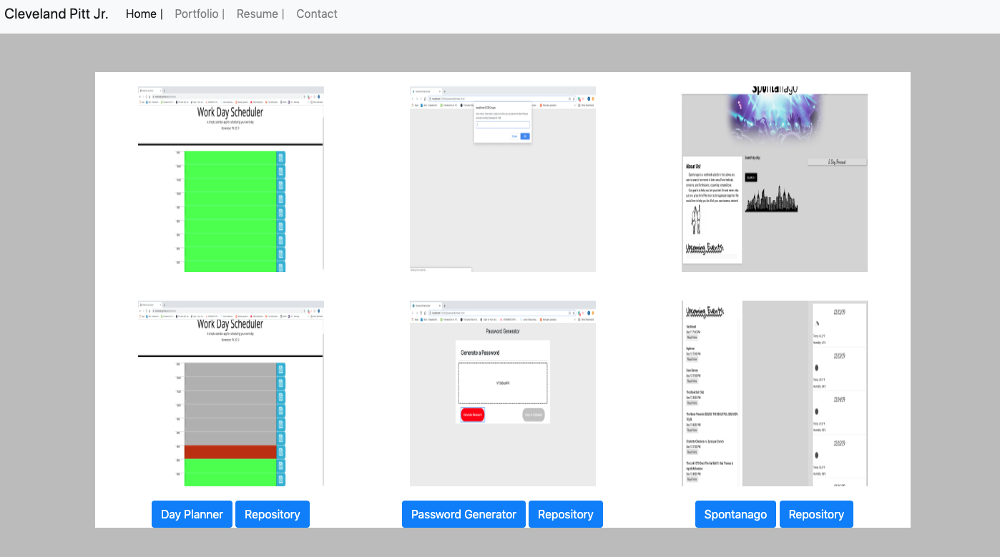
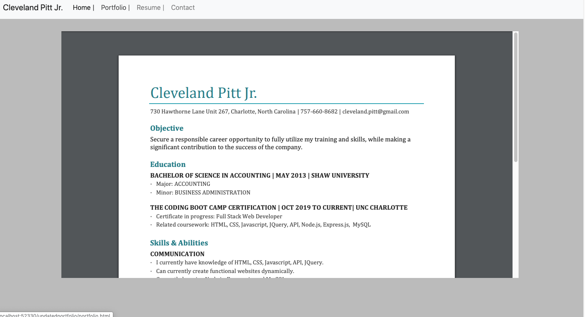
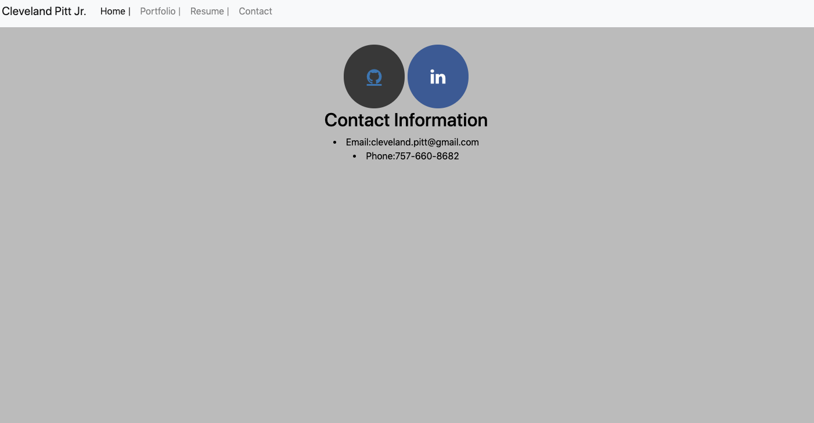

# updatedportfolio
A more in depth professional portfolio page

https://getbootstrap.com/docs/4.1/components/navbar/

https://getbootstrap.com/docs/4.0/layout/grid/

https://getbootstrap.com/docs/4.0/components/jumbotron/

https://www.w3schools.com/html/html_images.asp

https://www.w3schools.com/howto/howto_css_social_media_buttons.asp

